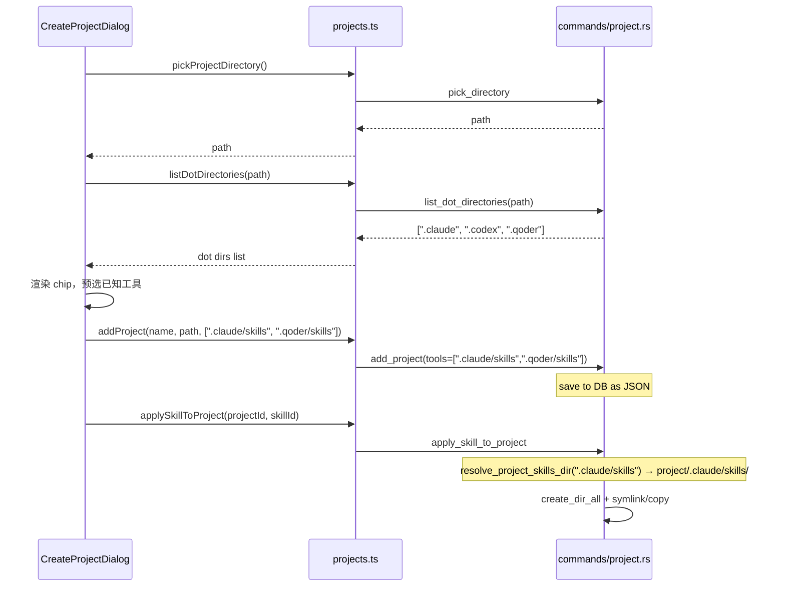

## 用户需求

在 `CreateProjectDialog` 的工具选择区域，改造为动态感知项目目录内已有的工具配置目录（`.` 开头的子目录），并支持用户自定义填写。

## 产品概述

当用户选择项目路径后，系统自动扫描该目录下所有 `.` 开头的子目录（如 `.claude`、`.codex`、`.qoder`），将其以 chip 形式展示供用户勾选。每个选项显示为 `<configDir>/skills`（例如 `.claude/skills`），其中 `skills` 为默认 skills 子文件夹名称。用户也可手动添加自定义条目，只需填写「配置目录名」和「skills 文件夹名」即可。最终保存的 tools 数据格式由原来的 `["claude"]` 变更为 `[".claude/skills"]` 这样的相对路径格式，后端应用 skill 时直接基于该路径拼接，无需再依赖硬编码的 AppType 映射。

## 核心功能

- **自动扫描点目录**：选择项目路径后，调用新增的 Tauri command `list_dot_directories`，获取目录内所有 `.` 开头的子目录名列表，作为可选 chip 展示
- **chip 选择 UI**：每个 chip 显示形如 `.claude/skills`，默认 skills 子目录名为 `skills`；原 SKILLS_APP_IDS 硬编码方案废弃
- **自定义工具条目**：提供添加自定义条目入口，用户填写配置目录（如 `.qoder`）和 skills 文件夹名（默认 `skills`），点击确认后追加为 chip
- **tools 格式升级**：tools 存储格式由 app id 字符串（如 `"claude"`）改为相对路径字符串（如 `".claude/skills"`），向后兼容旧格式数据
- **后端 apply 逻辑升级**：`apply_skill_to_project` 和 `remove_skill_from_project` 直接以 tool 字段的相对路径拼接 skills 目录，旧格式（不含 `/`）通过 fallback 映射兼容

## 技术栈

- **前端**：React + TypeScript + Tailwind CSS（现有项目栈）
- **组件库**：shadcn/ui（现有项目）
- **后端**：Rust + Tauri（现有项目）
- **i18n**：react-i18next（现有方案，zh/en/ja 三文件同步更新）

## 实现方案

### 整体策略

分两层改造：前端负责 UI 重构 + 格式转换（chip 展示、自定义输入）；后端负责新增目录扫描 command + 改造 apply/remove 路径逻辑，同时保持旧数据兼容。

### 1. 后端：新增 `list_dot_directories` command

在 `src-tauri/src/commands/project.rs` 中新增：

```rust
#[tauri::command]
pub fn list_dot_directories(path: String) -> Result<Vec<String>, String> {
    // 读取 path 下所有条目，过滤出以 "." 开头的子目录
    // 返回目录名列表，如 [".claude", ".codex", ".qoder"]
    // 路径不存在或读取失败时返回 Err
}
```

此 command 无副作用，纯只读扫描，无需修改数据库。

### 2. 后端：改造 `apply_skill_to_project` / `remove_skill_from_project`

现有的 `get_project_app_skills_dir` 硬编码 `AppType` 匹配，改为通用函数：

```rust
fn resolve_project_skills_dir(project_path: &str, tool: &str) -> std::path::PathBuf {
    if tool.contains('/') {
        // 新格式：".qoder/skills" -> project_path/.qoder/skills
        Path::new(project_path).join(tool)
    } else {
        // 旧格式兼容："claude" -> parse_app_type fallback
        get_project_app_skills_dir(project_path, &parse_app_type(tool).unwrap_or(AppType::Claude))
    }
}
```

`apply_skill_to_project` 和 `remove_skill_from_project` 中将 `get_project_app_skills_dir` 替换为 `resolve_project_skills_dir`，并移除 `parse_app_type` 的硬错误（改为 warn + skip → 新格式直接过），旧格式 fallback 保留用于向后兼容。

### 3. 前端：改造 `CreateProjectDialog`

**状态设计**：

- `dotDirs: string[]` — 扫描到的点目录列表
- `scanLoading: boolean` — 扫描中状态
- `selectedTools: string[]` — 已选的相对路径列表（如 `[".claude/skills"]`）
- `customConfigDir: string` — 自定义配置目录输入
- `customSkillsDir: string` — 自定义 skills 目录输入（默认 `"skills"`）

**逻辑流程**：

1. 选目录后（`handlePickDir` 中），调用 `list_dot_directories` 获取点目录列表
2. 将列表中能对应 SKILLS_APP_IDS 已知工具的条目（如 `.claude`、`.codex`）默认预选
3. chip 展示所有点目录，格式为 `<dir>/skills`（默认 skillsDir = `"skills"`）
4. 底部提供「+ 自定义」区域：输入 configDir 和 skillsDir，点击添加后追加进 chip 列表并自动选中
5. `onConfirm` 提交时传递 `selectedTools`（格式已为相对路径）

**已知工具默认预选规则**：扫描结果中包含 `.claude` → 预选 `.claude/skills`，以此类推，保持用户体验平滑。

### 4. 前端：新增 API / hook

在 `src/lib/api/projects.ts` 中新增：

```ts
async listDotDirectories(path: string): Promise<string[]> {
    return invoke("list_dot_directories", { path });
}
```

### 5. i18n 新增文案

`skills.project` 下新增：

- `toolsHint`：说明文字
- `dotDirsLoading`：扫描中
- `dotDirsEmpty`：无点目录提示
- `customTool`：自定义工具
- `customConfigDir`：配置目录占位
- `customSkillsDir`：Skills 文件夹
- `addCustomTool`：添加按钮文案
- `customToolInvalid`：校验提示

## 实现注意事项

- **向后兼容**：旧数据库中 tools 为 `["claude"]` 格式的项目，`resolve_project_skills_dir` 通过不含 `/` 的判断走 `parse_app_type` fallback，已有的 apply/remove 功能不受影响
- **目录创建**：`apply_skill_to_project` 中 `create_dir_all` 已有，新路径格式同样受益，无需额外处理
- **自定义输入校验**：configDir 必须以 `.` 开头，skillsDir 不能为空，不能与已有 chip 重复
- **扫描失败降级**：`list_dot_directories` 失败时前端不报错，chips 区域降级为空（用户可手动添加）
- **性能**：目录扫描仅列一层，O(n) 即可，不递归，无性能瓶颈

## 架构示意



## 目录结构

```
src-tauri/src/commands/
└── project.rs          # [MODIFY] 新增 list_dot_directories command；

# 新增 resolve_project_skills_dir 通用函数；

# apply_skill_to_project / remove_skill_from_project

# 替换为新路径解析逻辑，保留旧格式 fallback

src/lib/api/
└── projects.ts         # [MODIFY] 新增 listDotDirectories(path) API 方法

src/components/skills/
└── CreateProjectDialog.tsx  # [MODIFY] 重构工具选择区域：

# - 选路径后触发 list_dot_directories 扫描

# - chip 展示点目录，格式 <dir>/skills

# - 自定义工具表单（configDir + skillsDir 输入）

# - tools 提交格式改为相对路径字符串

src/i18n/locales/
├── zh.json             # [MODIFY] skills.project 下新增自定义工具相关文案（中文）
├── en.json             # [MODIFY] 同步新增英文文案
└── ja.json             # [MODIFY] 同步新增日文文案
`````