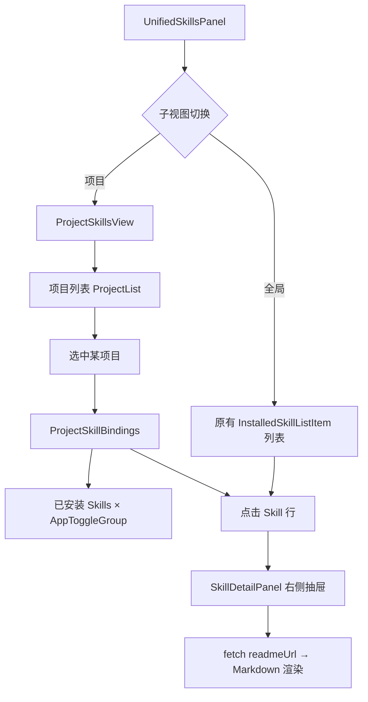

## 用户需求

当前 Skills 管理页面仅支持**全局维度**（某 Skill 在某 AI 开发工具下全局生效），用户希望在此基础上新增**项目 + 开发工具**维度的 Skills 管理，使某 Skill 可以只在指定本地项目目录下、对指定 AI 开发工具生效，实现更细粒度的 Skill 控制。

同时，用户希望在 Skill 卡片点击后，在右侧展开详情面板（含 README Markdown 内联渲染），并在整体布局上保持现有 Tab 切换模式不变。

## 产品概述

在现有 Skills 管理页面基础上，叠加「项目维度」管理能力。用户可以创建/管理项目（本地目录），并为每个项目分别配置哪些已安装的 Skills 在该项目中启用、对哪些 AI 开发工具生效。全局维度的 Skills 配置保持不变，项目维度是其补充。

## 核心功能

### 1. 已安装面板新增「全局 / 项目」子视图切换

- 「已安装」Tab 内部新增一个「全局 | 项目」子切换栏
- 「全局」视图为现有 `UnifiedSkillsPanel` 的列表，保持原有交互不变
- 「项目」视图显示项目列表及每个项目下各 Skill 的启用状态

### 2. 项目管理

- 支持通过系统文件选择器添加本地项目目录（选择文件夹）
- 项目记录：`{ id, name, path, createdAt }`，名称自动取目录名，允许用户修改
- 支持删除项目（不影响 Skill 本体）
- 项目列表以卡片/列表形式展示

### 3. 项目维度 Skill 绑定

- 在项目详情中显示全部已安装 Skills，按 AI 工具维度（AppToggleGroup）独立开关
- 数据结构：`project_skill_bindings`（project_id, skill_id, app, enabled）
- 项目维度的启用状态与全局维度相互独立，互不影响

### 4. Skill 详情右侧面板

- 点击任意 Skill 条目（已安装列表 / 发现页面卡片），在右侧滑出详情面板
- 详情面板展示：名称、描述、仓库信息、安装状态、README Markdown 内联渲染（通过 fetch readmeUrl 获取原始 Markdown）
- 面板可关闭，关闭时回到正常宽度布局

## 技术栈

- **前端**：React 18 + TypeScript，延续现有 shadcn/ui + Tailwind CSS 组件体系
- **状态管理**：TanStack Query（与现有 hooks 模式一致）
- **后端**：Tauri 2 + Rust，SQLite（通过现有 `database/dao` 层扩展）
- **Markdown 渲染**：现有项目已有 `MarkdownEditor.tsx` + CodeMirror，新增只读渲染可复用 `react-markdown`（项目已具备 markdown 处理能力）或直接 fetch raw README 渲染

## 实现方案

### 整体策略

采用「最小侵入」原则：

1. 现有 `UnifiedSkillsPanel` 内部增加子视图切换（全局/项目），不改变外层 `App.tsx` 路由逻辑
2. 后端新增两张表（`projects` + `project_skill_bindings`）及对应 Tauri command，前端新增对应 API 和 hooks
3. Skill 详情面板作为独立组件，通过右侧抽屉（`Sheet` 或受控 div）渲染，不影响主列表布局

### 数据流



### 后端数据结构新增

**新增 SQLite 表：**

```sql
-- 项目表
CREATE TABLE IF NOT EXISTS projects (
    id TEXT PRIMARY KEY,
    name TEXT NOT NULL,
    path TEXT NOT NULL UNIQUE,
    created_at INTEGER NOT NULL DEFAULT 0
);

-- 项目-Skill 绑定表（按 app 粒度控制启用状态）
CREATE TABLE IF NOT EXISTS project_skill_bindings (
    project_id TEXT NOT NULL,
    skill_id   TEXT NOT NULL,
    app        TEXT NOT NULL,  -- 'claude'|'codex'|'gemini'|'opencode'|'hermes'
    enabled    BOOLEAN NOT NULL DEFAULT 0,
    PRIMARY KEY (project_id, skill_id, app),
    FOREIGN KEY (project_id) REFERENCES projects(id) ON DELETE CASCADE,
    FOREIGN KEY (skill_id)   REFERENCES skills(id) ON DELETE CASCADE
);
```

**新增 Tauri commands：**

- `get_projects` / `add_project` / `update_project` / `delete_project`
- `get_project_skill_bindings(project_id)` / `set_project_skill_binding(project_id, skill_id, app, enabled)`

### 前端架构

**新增文件：**

- `src/components/skills/ProjectSkillsView.tsx` — 项目维度主视图
- `src/components/skills/ProjectList.tsx` — 项目列表+增删
- `src/components/skills/ProjectSkillBindings.tsx` — 项目下 Skills 绑定管理
- `src/components/skills/SkillDetailPanel.tsx` — 右侧详情抽屉（通用，已安装/发现页均可复用）
- `src/hooks/useProjects.ts` — 项目 CRUD hooks
- `src/lib/api/projects.ts` — 项目 API（invoke 封装）

**修改文件：**

- `src/components/skills/UnifiedSkillsPanel.tsx` — 增加「全局/项目」子切换栏
- `src/components/skills/SkillCard.tsx` — 增加 onClick 传递（触发详情面板）
- `src/components/skills/SkillsPage.tsx` — 增加详情面板入口
- `src-tauri/src/database/schema.rs` — 添加两张新表及 v8 迁移
- `src-tauri/src/database/dao/` — 新增 `projects.rs`
- `src-tauri/src/commands/skill.rs` — 新增项目相关命令（或新建 `commands/project.rs`）
- `src-tauri/src/lib.rs` — 注册新 commands
- `src/lib/api/skills.ts` — 新增 `openFolderDialog` 辅助 API
- `src/i18n/locales/zh.json` / `en.json` / `ja.json` — 新增 i18n key

## 实现注意事项

1. **向后兼容**：全局维度（`InstalledSkill.apps`）数据结构和现有 toggle command 完全不变，项目维度是独立表，零耦合
2. **数据库迁移**：在 `schema.rs` 新增 v8 迁移（仅 `CREATE TABLE IF NOT EXISTS`），`SCHEMA_VERSION` 从当前版本 +1，迁移函数只新建表，无破坏性操作
3. **Skill 详情 README 渲染**：`readmeUrl` 是 GitHub raw 地址，通过前端 `fetch` 获取原始 Markdown，再用 `react-markdown` 渲染；需处理网络失败的降级（显示 fallback 提示）；鉴于该地址为 GitHub CDN，考虑加 15s timeout
4. **项目路径选择**：复用现有 `settingsApi.openExternal` 模式，新增 `open_folder_dialog` Tauri command（调用 `tauri-plugin-dialog`，该 plugin 已作为 `tauri::plugin::dialog` 在项目中存在）
5. **React Query 缓存键**：项目相关 key 采用 `["projects", ...]`，绑定采用 `["projects", projectId, "bindings"]`，避免与现有 `["skills", ...]` 冲突
6. **`AppToggleGroup` 复用**：`ProjectSkillBindings` 中直接复用现有 `AppToggleGroup` 组件，传入从 `project_skill_bindings` 拼装的 `SkillApps` 对象

## 目录结构

```
src/
├── components/skills/
│   ├── UnifiedSkillsPanel.tsx        # [MODIFY] 新增「全局/项目」子视图切换栏；全局视图保持原有逻辑；项目视图渲染 ProjectSkillsView
│   ├── SkillsPage.tsx                # [MODIFY] 新增 onSkillClick 回调，点击卡片触发详情面板
│   ├── SkillCard.tsx                 # [MODIFY] 新增可选 onClick prop，点击卡片标题/名称区域触发
│   ├── ProjectSkillsView.tsx         # [NEW] 项目维度主容器。左侧项目列表（ProjectList），右侧为选中项目下的 Skills 绑定（ProjectSkillBindings）；无项目时显示引导添加
│   ├── ProjectList.tsx               # [NEW] 项目列表卡片：显示项目名称、路径、已配置 Skills 数量；操作：添加（触发 open_folder_dialog）、重命名、删除
│   ├── ProjectSkillBindings.tsx      # [NEW] 已安装 Skills 列表（复用 InstalledSkillListItem 样式）+ AppToggleGroup，数据来源为 project_skill_bindings；变更时 mutate 到后端
│   └── SkillDetailPanel.tsx          # [NEW] 右侧详情抽屉组件。接收 InstalledSkill | DiscoverableSkill，展示名称/描述/仓库/安装状态；若有 readmeUrl 则 fetch 并用 react-markdown 渲染 README；支持宽度动态展开/收起动画
│
├── hooks/
│   └── useProjects.ts                # [NEW] useGetProjects / useAddProject / useUpdateProject / useDeleteProject / useProjectSkillBindings / useSetProjectSkillBinding —— 遵循现有 useSkills.ts 的 TanStack Query 模式
│
└── lib/api/
    └── projects.ts                   # [NEW] projectsApi 对象，封装 invoke 调用：get_projects / add_project / update_project_name / delete_project / get_project_skill_bindings / set_project_skill_binding / open_folder_dialog

src-tauri/src/
├── commands/
│   └── project.rs                    # [NEW] 项目 CRUD 及 Skill 绑定 Tauri commands；open_folder_dialog 调用 tauri_plugin_dialog::pick_folder；注册到 lib.rs
│
├── database/
│   ├── schema.rs                     # [MODIFY] 新增 projects / project_skill_bindings 表 CREATE IF NOT EXISTS；新增 v8 迁移函数（纯建表）；SCHEMA_VERSION + 1
│   └── dao/
│       └── projects.rs               # [NEW] Database impl 扩展：get_all_projects / save_project / delete_project / get_project_skill_bindings / set_project_skill_binding / delete_project_bindings_by_skill
│
└── lib.rs                            # [MODIFY] 注册 project.rs 中的新 commands；引入 project 模块

src/i18n/locales/
├── zh.json                           # [MODIFY] 新增 skills.project.* 系列 i18n key
├── en.json                           # [MODIFY] 同上
└── ja.json                           # [MODIFY] 同上
```

## 设计风格

延续现有应用设计语言（shadcn/ui + Tailwind CSS，支持暗色模式）。

### 「全局/项目」子切换栏

与现有「已安装/发现」Tab 风格一致，使用紧凑型 pill 切换按钮（`inline-flex rounded-md border bg-background p-1`），放置于 `UnifiedSkillsPanel` 顶部操作区。

### 项目维度视图（ProjectSkillsView）

- 左右分栏布局：左侧 220px 固定宽项目侧边栏（项目卡片列表）+ 右侧 Skill 绑定区域
- 项目卡片：名称（粗体）+ 路径（mono 小字，truncate）+ 已配置数量 badge
- 选中项目高亮：`bg-primary/10 border-primary/30`
- 添加项目按钮：`variant="outline"` 带 `+` 图标

### Skill 详情面板（SkillDetailPanel）

- 右侧滑出式抽屉（`Sheet` from shadcn/ui），宽度 400px，`side="right"`
- 顶部：Skill 名称（h2）+ 安装状态 badge（已安装/未安装）+ 关闭按钮
- 中部元信息区：仓库来源、目录名、AI 工具启用状态图标
- README 区：滚动区域，`prose prose-sm dark:prose-invert` 样式，加载中显示 skeleton
- 网络失败降级：灰色提示框 + 跳转外部链接按钮

## 使用的 Agent 扩展

### Skill

- **prd**
- 用途：按照 PRD 标准结构（执行摘要、用户故事、验收标准、技术规格、风险路线图）输出完整需求文档，用于当前 Skills 管理页面改造需求的文档化
- 预期结果：生成一份完整的产品需求文档，涵盖项目维度 Skills 管理与 Skill 详情面板的所有功能要求和验收标准

- **to-prd**
- 用途：将当前对话上下文（需求澄清结果 + 技术方案）整理并发布为正式 PRD 文档
- 预期结果：输出结构化 PRD 文档（可保存为 docs/ 下的 markdown 文件），供后续开发迭代参考